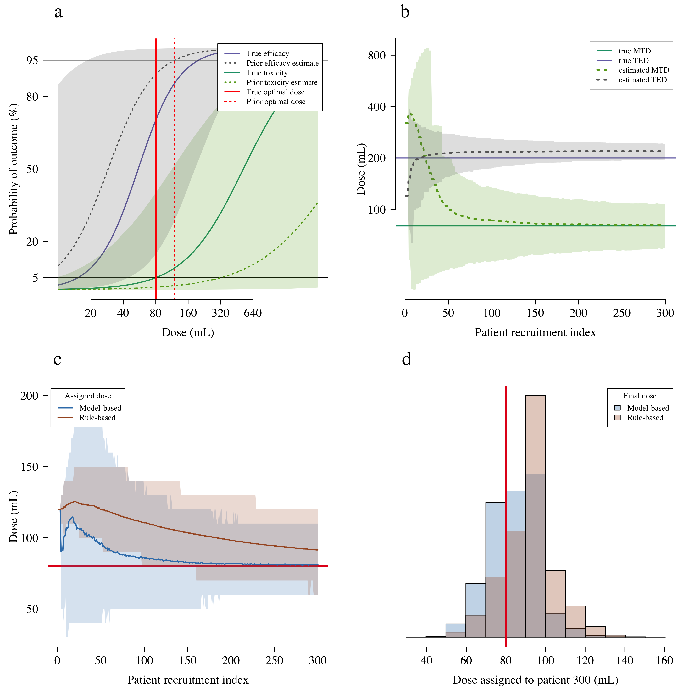
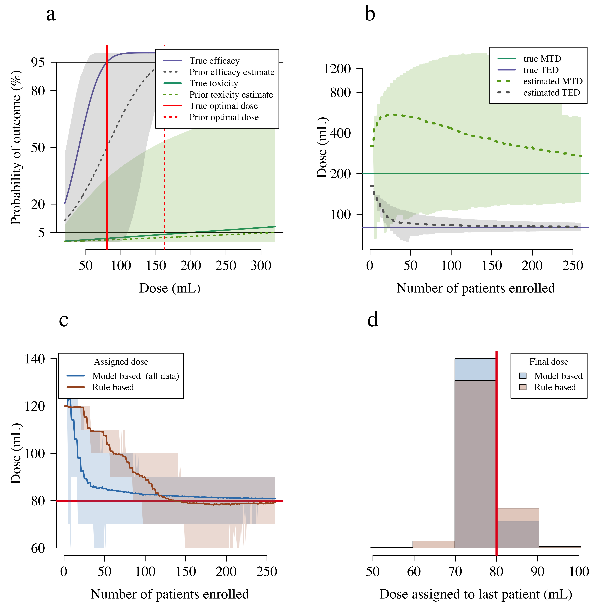
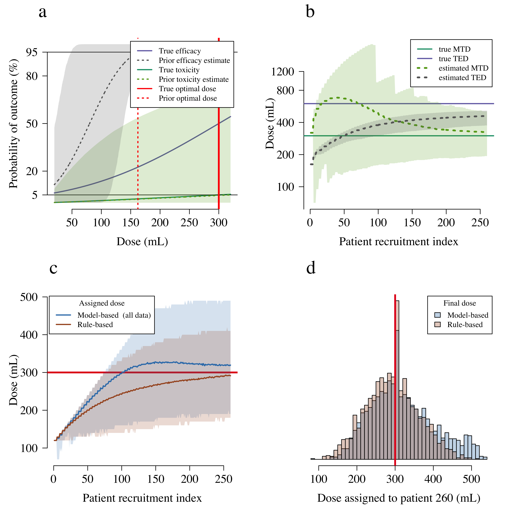
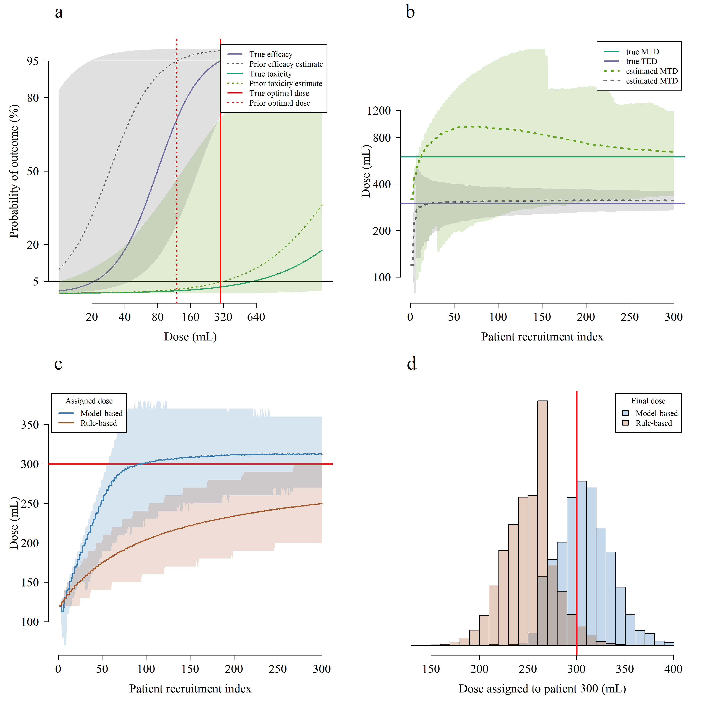

## Setup model parameters


```r
source('Core_functions.R')
source('Simulation_functions.R')
source('plotting_functions.R')
TEL = 0.95  # Target Efficacy Level
MTT = 0.05  # Maximum Tolerated Toxicity
N_max = 300 # Maximum number of patients recruited
max_increment = 1 # Maximum dose increment to doses previously unseen
N_trials = 2000
N_batch = 3
Randomisation_p_SOC = 0.2 # proportion randomised to the standard of care dose
starting_dose = 12 # starting dose in adaptive arm
SoC = 8 # Standard of Care (only for the adaptive design)

# function that solves for the beta value based on interpretable parameters
solve_beta = function(alpha_val, v_star, y_star){
  beta_val = ( logit(y_star) - alpha_val ) / log2(v_star)
  return(beta_val)
}
```

## Priors


```r
#******* Prior point estimates *********
Prior_TED = 12;                   # prior estimate of the Target Efficacious Dose
Prior_alpha_eff = logit(1/10)       # prior estimate of the efficacy with one vial
Prior_beta_eff = solve_beta(alpha_val = Prior_alpha_eff, v_star = Prior_TED, y_star = TEL)

Prior_MTD = 32;                    # prior estimate of the Maximum Tolerated Dose
Prior_alpha_tox = logit(1/1000)    # prior estimate of the toxicity after 1 vial
Prior_beta_tox = solve_beta(alpha_val = Prior_alpha_tox, v_star = Prior_MTD, y_star = MTT)

#******* Prior uncertainty estimates *******
prior_model_params = list(beta_tox = Prior_beta_tox,
                          beta_tox_sd = .05,
                          alpha_tox=Prior_alpha_tox,
                          alpha_tox_sd = 2,
                          beta_eff=Prior_beta_eff, 
                          beta_eff_sd = .05, 
                          alpha_eff=Prior_alpha_eff,
                          alpha_eff_sd = 2)
```


## Simulation 1


```r
true_alpha_eff = logit(1/50)
true_TED = 20  # 
true_beta_eff = solve_beta(alpha_val = true_alpha_eff, v_star = true_TED, y_star = TEL)


true_alpha_tox = logit(1/500)  # toxicity at 1 vial
true_MTD = 8  # simulation truth for the MTD 
true_beta_tox = solve_beta(alpha_val = true_alpha_tox, v_star = true_MTD, y_star = MTT)


model_params_true = list(beta_tox = true_beta_tox,
                         alpha_tox=true_alpha_tox,
                         beta_eff=true_beta_eff, 
                         alpha_eff=true_alpha_eff)

tic()
writeLines('\nSimulation 1, adaptive design...')
```

```
## 
## Simulation 1, adaptive design...
```

```r
Full_Simulation(model_params_true = model_params_true,
                prior_model_params = prior_model_params,
                N_trials = N_trials,
                MTT = MTT, TEL = TEL,
                N_max = N_max, 
                N_batch = N_batch,
                max_increment = max_increment, 
                Randomisation_p_SOC = Randomisation_p_SOC,
                sim_title = 'Simulation scenario 1',
                FORCE_RERUN=FORCE_RERUN, 
                N_cores = N_cores, 
                individ_plots = individ_plots,
                design_type = 'Adaptive',
                starting_dose = starting_dose,
                SoC = SoC)
```

```
## [1] "done the trial simulation, now plotting results"
```

```r
toc()
```

```
## 1.05 sec elapsed
```

```r
tic()
writeLines('\nSimulation 1, 3+3 design...')
```

```
## 
## Simulation 1, 3+3 design...
```

```r
Full_Simulation(model_params_true = model_params_true,
                prior_model_params = prior_model_params,
                N_trials = 10*N_trials,
                MTT = MTT, TEL = TEL,
                N_max = N_max, 
                N_batch = 3,
                max_increment = max_increment, 
                Randomisation_p_SOC = 0,
                sim_title = 'Simulation scenario 1',
                FORCE_RERUN=FORCE_RERUN, 
                N_cores = N_cores, 
                individ_plots = individ_plots,
                design_type = '3+3',
                starting_dose = starting_dose,
                SoC = SoC)
```

```
## [1] "done the trial simulation, now plotting results"
```

```r
toc()
```

```
## 1.66 sec elapsed
```

```r
compare_rule_vs_model(sim_title = 'Simulation scenario 1',
                      model_params_true = model_params_true,
                      prior_model_params = prior_model_params)
```

<!-- -->

```
## For the rule-based design, 19% of trials give patient 300 a dose within +/-10% of the true optimal dose
## For the model-based design, 27% of trials give patient 300 a dose within +/-10% of the true optimal dose
```


## Simulation 2


```r
true_alpha_eff = logit(1/20)
true_TED = 8  # simulation truth for the MED 
true_beta_eff = solve_beta(alpha_val = true_alpha_eff, v_star = true_TED, y_star = TEL)

true_alpha_tox = logit(1/500)  # toxicity at 1 vial
true_MTD = 20  # simulation truth for the MTD 
true_beta_tox = solve_beta(alpha_val = true_alpha_tox, v_star = true_MTD, y_star = MTT)


model_params_true = list(beta_tox = true_beta_tox,
                         alpha_tox=true_alpha_tox,
                         beta_eff=true_beta_eff, 
                         alpha_eff=true_alpha_eff)

tic()
writeLines('\nSimulation 2....')
```

```
## 
## Simulation 2....
```

```r
Full_Simulation(model_params_true = model_params_true,
                prior_model_params = prior_model_params,
                N_trials = N_trials,
                MTT = MTT,
                TEL = TEL,
                N_max = N_max, 
                N_batch = N_batch,
                max_increment = max_increment,
                Randomisation_p_SOC = Randomisation_p_SOC,
                sim_title='Simulation scenario 2',
                FORCE_RERUN=FORCE_RERUN, 
                N_cores = N_cores, 
                individ_plots = individ_plots,
                design_type = 'Adaptive',
                starting_dose = starting_dose,
                SoC = SoC)
```

```
## [1] "done the trial simulation, now plotting results"
```

```r
toc()
```

```
## 0.36 sec elapsed
```

```r
tic()
writeLines('\nSimulation 2, 3+3 design...')
```

```
## 
## Simulation 2, 3+3 design...
```

```r
Full_Simulation(model_params_true = model_params_true,
                prior_model_params = prior_model_params,
                N_trials = 10*N_trials,
                MTT = MTT, TEL = TEL,
                N_max = N_max, 
                N_batch = 3,
                max_increment = max_increment, 
                Randomisation_p_SOC = 0,
                sim_title = 'Simulation scenario 2',
                FORCE_RERUN=FORCE_RERUN, 
                N_cores = N_cores, 
                individ_plots = individ_plots,
                design_type = '3+3',
                starting_dose = starting_dose,
                SoC = SoC)
```

```
## [1] "done the trial simulation, now plotting results"
```

```r
toc()
```

```
## 1.08 sec elapsed
```

```r
compare_rule_vs_model(sim_title = 'Simulation scenario 2',
                      model_params_true = model_params_true,
                      prior_model_params = prior_model_params)
```

<!-- -->

```
## For the rule-based design, 35% of trials give patient 300 a dose within +/-10% of the true optimal dose
## For the model-based design, 47% of trials give patient 300 a dose within +/-10% of the true optimal dose
```


## Simulation 3


```r
true_alpha_eff = logit(1/100)
true_TED = 60  # simulation truth for the MED 
true_beta_eff = solve_beta(alpha_val = true_alpha_eff, v_star = true_TED, y_star = TEL)


true_alpha_tox = logit(1/1000)  # toxicity at 1 vial
true_MTD = 30  # simulation truth for the MTD 
true_beta_tox = solve_beta(alpha_val = true_alpha_tox, v_star = true_MTD, y_star = MTT)


model_params_true = list(beta_tox = true_beta_tox,
                         alpha_tox=true_alpha_tox,
                         beta_eff=true_beta_eff, 
                         alpha_eff=true_alpha_eff)


tic()
writeLines('\nSimulation 3....')
```

```
## 
## Simulation 3....
```

```r
Full_Simulation(model_params_true = model_params_true,
                prior_model_params = prior_model_params,
                N_trials = N_trials,
                MTT = MTT,
                TEL = TEL,
                N_max = N_max, 
                N_batch = N_batch,
                max_increment = max_increment,
                Randomisation_p_SOC = Randomisation_p_SOC,
                sim_title='Simulation scenario 3',
                FORCE_RERUN=FORCE_RERUN, 
                N_cores = N_cores, 
                individ_plots = individ_plots,
                design_type = 'Adaptive',
                starting_dose = starting_dose,
                SoC = SoC)
```

```
## [1] "done the trial simulation, now plotting results"
```

```r
toc()
```

```
## 0.4 sec elapsed
```

```r
tic()
writeLines('\nSimulation 3, 3+3 design...')
```

```
## 
## Simulation 3, 3+3 design...
```

```r
Full_Simulation(model_params_true = model_params_true,
                prior_model_params = prior_model_params,
                N_trials = 10*N_trials,
                MTT = MTT, TEL = TEL,
                N_max = N_max, 
                N_batch = 3,
                max_increment = max_increment, 
                Randomisation_p_SOC = 0,
                sim_title = 'Simulation scenario 3',
                FORCE_RERUN=FORCE_RERUN, 
                N_cores = N_cores, 
                individ_plots = individ_plots,
                design_type = '3+3',
                starting_dose = starting_dose,
                SoC = SoC)
```

```
## [1] "done the trial simulation, now plotting results"
```

```r
toc()
```

```
## 0.99 sec elapsed
```

```r
compare_rule_vs_model(sim_title = 'Simulation scenario 3',
                      model_params_true = model_params_true,
                      prior_model_params = prior_model_params)
```

<!-- -->

```
## For the rule-based design, 40% of trials give patient 300 a dose within +/-10% of the true optimal dose
## For the model-based design, 31% of trials give patient 300 a dose within +/-10% of the true optimal dose
```

## Simulation 4


```r
true_alpha_eff = logit(1/100)
true_TED = 30  # simulation truth for the MED 
true_beta_eff = solve_beta(alpha_val = true_alpha_eff, v_star = true_TED, y_star = TEL)


true_alpha_tox = logit(1/1000)  # toxicity at 1 vial
true_MTD = 60  # simulation truth for the MTD 
true_beta_tox = solve_beta(alpha_val = true_alpha_tox, v_star = true_MTD, y_star = MTT)

model_params_true = list(beta_tox = true_beta_tox,
                         alpha_tox=true_alpha_tox,
                         beta_eff=true_beta_eff, 
                         alpha_eff=true_alpha_eff)

tic()
writeLines('\nSimulation 4, Adaptive design ...')
```

```
## 
## Simulation 4, Adaptive design ...
```

```r
Full_Simulation(model_params_true = model_params_true,
                prior_model_params = prior_model_params,
                N_trials = N_trials,
                MTT = MTT,
                TEL = TEL,
                N_max = N_max, 
                N_batch = N_batch,
                max_increment = max_increment,
                Randomisation_p_SOC = Randomisation_p_SOC,
                sim_title='Simulation scenario 4',
                FORCE_RERUN=FORCE_RERUN, 
                N_cores = N_cores, 
                individ_plots = individ_plots,
                design_type = 'Adaptive',
                starting_dose = starting_dose,
                SoC = SoC,epsilon = 0.01)
```

```
## [1] "done the trial simulation, now plotting results"
```

```r
toc()
```

```
## 0.36 sec elapsed
```

```r
tic()
writeLines('\nSimulation 4, 3+3 design ...')
```

```
## 
## Simulation 4, 3+3 design ...
```

```r
Full_Simulation(model_params_true = model_params_true,
                prior_model_params = prior_model_params,
                N_trials = 10*N_trials,
                MTT = MTT, TEL = TEL,
                N_max = N_max, 
                N_batch = 3,
                max_increment = max_increment, 
                Randomisation_p_SOC = Randomisation_p_SOC,
                sim_title = 'Simulation scenario 4',
                FORCE_RERUN=FORCE_RERUN, 
                N_cores = N_cores, 
                individ_plots = individ_plots,
                design_type = '3+3',
                starting_dose = starting_dose,
                SoC = SoC)
```

```
## [1] "done the trial simulation, now plotting results"
```

```r
toc()
```

```
## 1.03 sec elapsed
```

```r
compare_rule_vs_model(sim_title = 'Simulation scenario 4',
                      model_params_true = model_params_true,
                      prior_model_params = prior_model_params)
```

<!-- -->

```
## For the rule-based design, 18% of trials give patient 300 a dose within +/-10% of the true optimal dose
## For the model-based design, 72% of trials give patient 300 a dose within +/-10% of the true optimal dose
```
