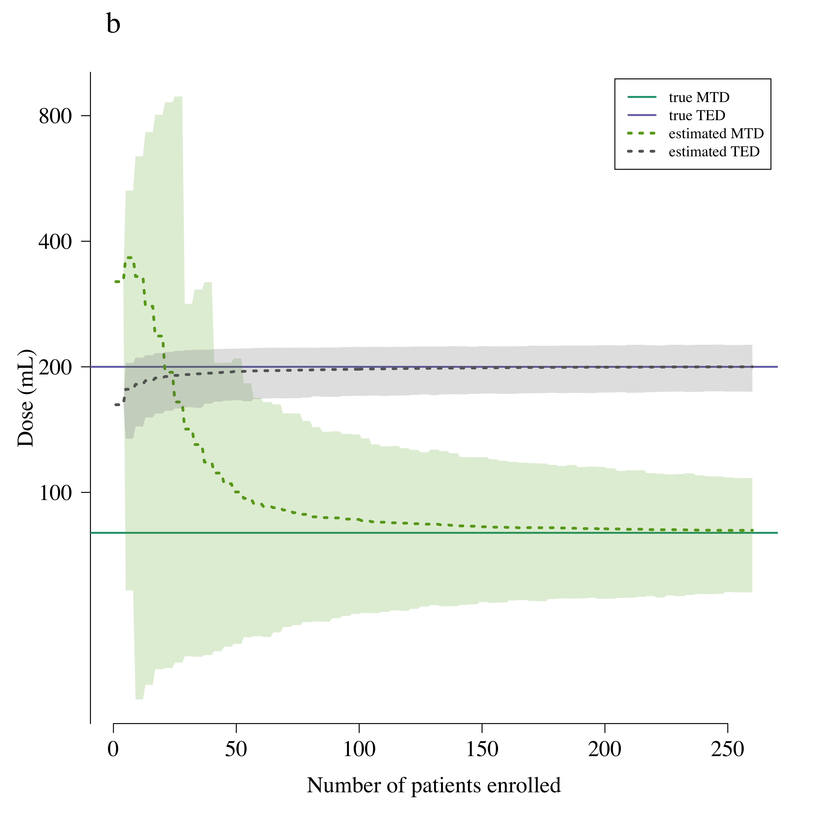
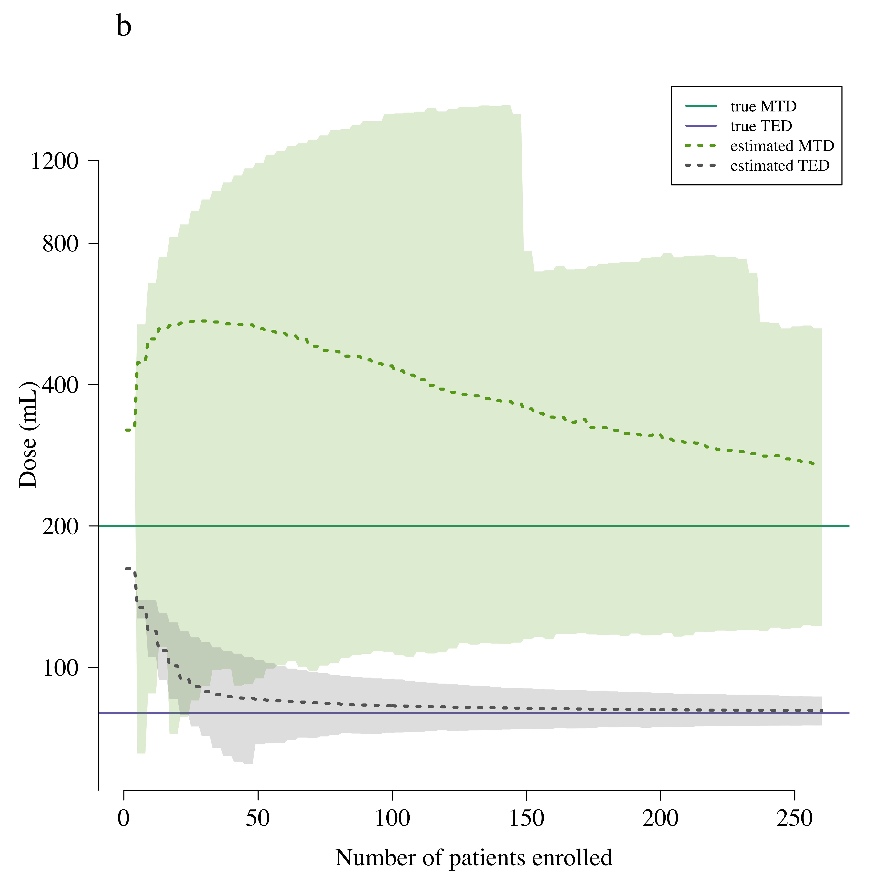
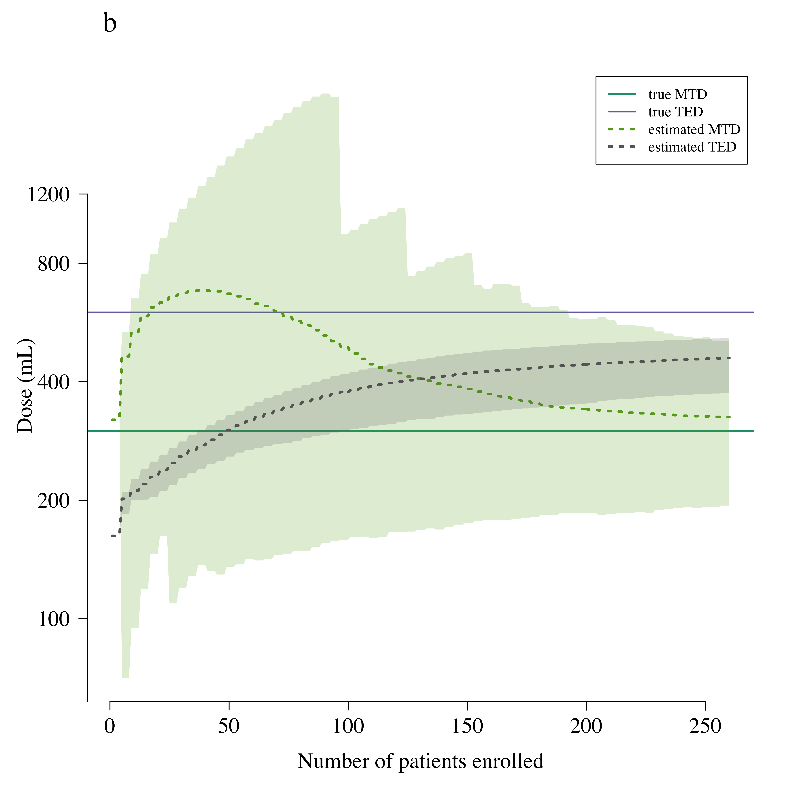
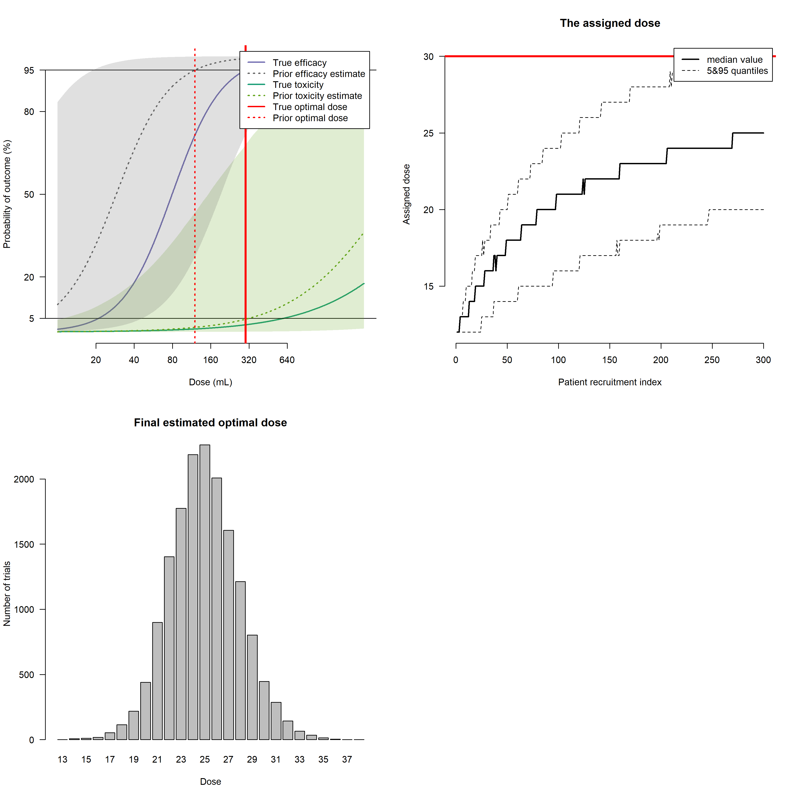
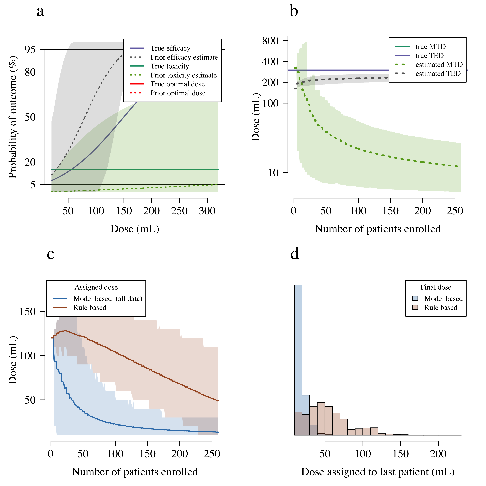

## Setup model parameters


```r
source('Core_functions.R')
source('Simulation_functions.R')
source('plotting_functions.R')
source('wrapper_function_all_scenarios.R')
TEL = 0.95  # Target Efficacy Level
MTT = 0.05  # Maximum Tolerated Toxicity
N_max = 250 # Maximum number of patients recruited
max_increment = 1 # Maximum dose increment to doses previously unseen
N_trials = 2000
N_batch = 3
Randomisation_p_SOC = 0.2 # proportion randomised to the standard of care dose
starting_dose = 12 # starting dose in adaptive arm
SoC = 8 # Standard of Care

# function that solves for the beta value based on interpretable parameters
solve_beta = function(alpha_val, v_star, y_star){
  beta_val = ( logit(y_star) - alpha_val ) / log2(v_star)
  return(beta_val)
}
```

## Priors


```r
#******* Prior point estimates *********
Prior_TED = 12;                   # prior estimate of the Target Efficacious Dose
Prior_alpha_eff = logit(1/10)       # prior estimate of the efficacy with one vial
Prior_beta_eff = solve_beta(alpha_val = Prior_alpha_eff, v_star = Prior_TED, y_star = TEL)

Prior_MTD = 32;                    # prior estimate of the Maximum Tolerated Dose
Prior_alpha_tox = logit(1/1000)    # prior estimate of the toxicity after 1 vial
Prior_beta_tox = solve_beta(alpha_val = Prior_alpha_tox, v_star = Prior_MTD, y_star = MTT)

#******* Prior uncertainty estimates *******
prior_model_params = list(beta_tox = Prior_beta_tox,
                          beta_tox_sd = .05,
                          alpha_tox=Prior_alpha_tox,
                          alpha_tox_sd = 2,
                          beta_eff=Prior_beta_eff, 
                          beta_eff_sd = .05, 
                          alpha_eff=Prior_alpha_eff,
                          alpha_eff_sd = 2)
```


## Simulation 1


```r
true_alpha_eff = logit(1/50)
true_TED = 20  # 
true_beta_eff = solve_beta(alpha_val = true_alpha_eff, v_star = true_TED, y_star = TEL)


true_alpha_tox = logit(1/500)  # toxicity at 1 vial
true_MTD = 8  # simulation truth for the MTD 
true_beta_tox = solve_beta(alpha_val = true_alpha_tox, v_star = true_MTD, y_star = MTT)

# well-specified simulation truth
model_params_true = list(beta_tox = true_beta_tox,
                         alpha_tox=true_alpha_tox,
                         beta_eff=true_beta_eff, 
                         alpha_eff=true_alpha_eff)

# mis-specified simulation truth
xs = seq(0, 1000, by=.1)
tox_zero = 1; tox_MTD = true_MTD
slope_tox = MTT/(tox_MTD - tox_zero)
intercept_tox = -slope_tox * tox_zero
ys = slope_tox*xs + intercept_tox
ys[ys>1]=1; ys[ys<0]=0
f_true_tox = approxfun(x = xs, y = ys, rule = 2)

eff_zero = 1; eff_TED = true_TED
slope_eff = TEL/(eff_TED - eff_zero)
intercept_eff = -slope_eff * eff_zero
ys = slope_eff*xs + intercept_eff
ys[ys>1]=1; ys[ys<0]=0
f_true_eff = approxfun(x = xs, ys, rule = 2)
true_model = list(tox = f_true_tox, eff = f_true_eff)

run_all_scenarios(model_params_true = model_params_true,
                  true_model = true_model,
                  prior_model_params = prior_model_params,
                  N_trials = N_trials,
                  MTT = MTT, TEL = TEL,
                  N_max = N_max, 
                  N_batch = N_batch,
                  max_increment = max_increment, 
                  Randomisation_p_SOC = Randomisation_p_SOC,
                  sim_title = 'Simulation scenario 1',
                  FORCE_RERUN=FORCE_RERUN, 
                  N_cores = N_cores, 
                  starting_dose = starting_dose,
                  SoC = SoC)
```

```
## Simulation scenario 1 , model based design, well-specified, ...
## [1] "well_specified"
## 5211.722 sec elapsed
## Simulation scenario 1 , model based design, mis-specified, ...
## [1] "mis_specified"
## 5394.597 sec elapsed
## Simulation scenario 1 , rule based design, well-specified, ...
## [1] "well_specified"
## 187.173 sec elapsed
## Simulation scenario 1 , rule based design, mis-specified, ...
## [1] "mis_specified"
## 191.035 sec elapsed
```

```r
# Comparison in well-specified case
compare_rule_vs_model(sim_title = 'Simulation scenario 1',
                      model_params_true = model_params_true,
                      true_model = NULL,
                      prior_model_params = prior_model_params)
```

<!-- -->

```
## For the rule-based design, 12% of trials give patient 252 a dose within +/-10% of the true optimal dose
## For the model-based design, 27% of trials give patient 252 a dose within +/-10% of the true optimal dose
```

```r
# Comparison in mis-specified case
compare_rule_vs_model(sim_title = 'Simulation scenario 1',
                      model_params_true = NULL,
                      true_model = true_model,
                      prior_model_params = prior_model_params)
```

<!-- -->

```
## For the rule-based design, 5% of trials give patient 252 a dose within +/-10% of the true optimal dose
## For the model-based design, 22% of trials give patient 252 a dose within +/-10% of the true optimal dose
```


## Simulation 2


```r
true_alpha_eff = logit(1/20)
true_TED = 8  # simulation truth for the MED 
true_beta_eff = solve_beta(alpha_val = true_alpha_eff, v_star = true_TED, y_star = TEL)

true_alpha_tox = logit(1/500)  # toxicity at 1 vial
true_MTD = 20  # simulation truth for the MTD 
true_beta_tox = solve_beta(alpha_val = true_alpha_tox, v_star = true_MTD, y_star = MTT)


# well-specified simulation truth
model_params_true = list(beta_tox = true_beta_tox,
                         alpha_tox = true_alpha_tox,
                         beta_eff = true_beta_eff, 
                         alpha_eff = true_alpha_eff)

# mis-specified simulation truth
xs = seq(0, 1000, by=.1)
tox_zero = 1; tox_MTD = true_MTD
slope_tox = MTT/(tox_MTD - tox_zero)
intercept_tox = -slope_tox * tox_zero
ys = slope_tox*xs + intercept_tox
ys[ys>1]=1; ys[ys<0]=0
f_true_tox = approxfun(x = xs, y = ys, rule = 2)

eff_zero = 1; eff_TED = true_TED
slope_eff = TEL/(eff_TED - eff_zero)
intercept_eff = -slope_eff * eff_zero
ys = slope_eff*xs + intercept_eff
ys[ys>1]=1; ys[ys<0]=0
f_true_eff = approxfun(x = xs, ys, rule = 2)
true_model = list(tox = f_true_tox, eff = f_true_eff)

run_all_scenarios(model_params_true = model_params_true,
                  true_model = true_model,
                  prior_model_params = prior_model_params,
                  N_trials = N_trials,
                  MTT = MTT, TEL = TEL,
                  N_max = N_max, 
                  N_batch = N_batch,
                  max_increment = max_increment, 
                  Randomisation_p_SOC = Randomisation_p_SOC,
                  sim_title = 'Simulation scenario 2',
                  FORCE_RERUN=FORCE_RERUN, 
                  N_cores = N_cores, 
                  starting_dose = starting_dose,
                  SoC = SoC)
```

```
## Simulation scenario 2 , model based design, well-specified, ...
## [1] "well_specified"
## 5135.992 sec elapsed
## Simulation scenario 2 , model based design, mis-specified, ...
## [1] "mis_specified"
## 5127.797 sec elapsed
## Simulation scenario 2 , rule based design, well-specified, ...
## [1] "well_specified"
## 192.246 sec elapsed
## Simulation scenario 2 , rule based design, mis-specified, ...
## [1] "mis_specified"
## 186.854 sec elapsed
```

```r
# Comparison in well-specified case
compare_rule_vs_model(sim_title = 'Simulation scenario 2',
                      model_params_true = model_params_true,
                      true_model = NULL,
                      prior_model_params = prior_model_params)
```

<!-- -->

```
## For the rule-based design, 32% of trials give patient 252 a dose within +/-10% of the true optimal dose
## For the model-based design, 42% of trials give patient 252 a dose within +/-10% of the true optimal dose
```

```r
# Comparison in mis-specified case
compare_rule_vs_model(sim_title = 'Simulation scenario 2',
                      model_params_true = NULL,
                      true_model = true_model,
                      prior_model_params = prior_model_params)
```

<!-- -->

```
## For the rule-based design, 63% of trials give patient 252 a dose within +/-10% of the true optimal dose
## For the model-based design, 75% of trials give patient 252 a dose within +/-10% of the true optimal dose
```


## Simulation 3


```r
true_alpha_eff = logit(1/100)
true_TED = 60  # simulation truth for the MED 
true_beta_eff = solve_beta(alpha_val = true_alpha_eff, v_star = true_TED, y_star = TEL)


true_alpha_tox = logit(1/1000)  # toxicity at 1 vial
true_MTD = 30  # simulation truth for the MTD 
true_beta_tox = solve_beta(alpha_val = true_alpha_tox, v_star = true_MTD, y_star = MTT)


# well-specified simulation truth
model_params_true = list(beta_tox = true_beta_tox,
                         alpha_tox = true_alpha_tox,
                         beta_eff = true_beta_eff, 
                         alpha_eff = true_alpha_eff)

# mis-specified simulation truth
xs = seq(0, 1000, by=.1)
tox_zero = 1; tox_MTD = true_MTD
slope_tox = MTT/(tox_MTD - tox_zero)
intercept_tox = -slope_tox * tox_zero
ys = slope_tox*xs + intercept_tox
ys[ys>1]=1; ys[ys<0]=0
f_true_tox = approxfun(x = xs, y = ys, rule = 2)

eff_zero = 1; eff_TED = true_TED
slope_eff = TEL/(eff_TED - eff_zero)
intercept_eff = -slope_eff * eff_zero
ys = slope_eff*xs + intercept_eff
ys[ys>1]=1; ys[ys<0]=0
f_true_eff = approxfun(x = xs, ys, rule = 2)
true_model = list(tox = f_true_tox, eff = f_true_eff)

run_all_scenarios(model_params_true = model_params_true,
                  true_model = true_model,
                  prior_model_params = prior_model_params,
                  N_trials = N_trials,
                  MTT = MTT, TEL = TEL,
                  N_max = N_max, 
                  N_batch = N_batch,
                  max_increment = max_increment, 
                  Randomisation_p_SOC = Randomisation_p_SOC,
                  sim_title = 'Simulation scenario 3',
                  FORCE_RERUN=FORCE_RERUN, 
                  N_cores = N_cores, 
                  starting_dose = starting_dose,
                  SoC = SoC)
```

```
## Simulation scenario 3 , model based design, well-specified, ...
## [1] "well_specified"
## 5673.606 sec elapsed
## Simulation scenario 3 , model based design, mis-specified, ...
## [1] "mis_specified"
## 5950.758 sec elapsed
## Simulation scenario 3 , rule based design, well-specified, ...
## [1] "well_specified"
## 186.256 sec elapsed
## Simulation scenario 3 , rule based design, mis-specified, ...
## [1] "mis_specified"
## 184.883 sec elapsed
```

```r
# Comparison in well-specified case
compare_rule_vs_model(sim_title = 'Simulation scenario 3',
                      model_params_true = model_params_true,
                      true_model = NULL,
                      prior_model_params = prior_model_params)
```

<!-- -->

```
## For the rule-based design, 39% of trials give patient 252 a dose within +/-10% of the true optimal dose
## For the model-based design, 28% of trials give patient 252 a dose within +/-10% of the true optimal dose
```

```r
# Comparison in mis-specified case
compare_rule_vs_model(sim_title = 'Simulation scenario 3',
                      model_params_true = NULL,
                      true_model = true_model,
                      prior_model_params = prior_model_params)
```

<!-- -->

```
## For the rule-based design, 28% of trials give patient 252 a dose within +/-10% of the true optimal dose
## For the model-based design, 27% of trials give patient 252 a dose within +/-10% of the true optimal dose
```

## Simulation 4


```r
true_alpha_eff = logit(1/100)
true_TED = 30  # simulation truth for the MED 
true_beta_eff = solve_beta(alpha_val = true_alpha_eff, v_star = true_TED, y_star = TEL)


true_alpha_tox = logit(1/1000)  # toxicity at 1 vial
true_MTD = 60  # simulation truth for the MTD 
true_beta_tox = solve_beta(alpha_val = true_alpha_tox, v_star = true_MTD, y_star = MTT)

# well-specified simulation truth
model_params_true = list(beta_tox = true_beta_tox,
                         alpha_tox = true_alpha_tox,
                         beta_eff = true_beta_eff, 
                         alpha_eff = true_alpha_eff)

# mis-specified simulation truth
xs = seq(0, 1000, by=.1)
tox_zero = 1; tox_MTD = true_MTD
slope_tox = MTT/(tox_MTD - tox_zero)
intercept_tox = -slope_tox * tox_zero
ys = slope_tox*xs + intercept_tox
ys[ys>1]=1; ys[ys<0]=0
f_true_tox = approxfun(x = xs, y = ys, rule = 2)

eff_zero = 1; eff_TED = true_TED
slope_eff = TEL/(eff_TED - eff_zero)
intercept_eff = -slope_eff * eff_zero
ys = slope_eff*xs + intercept_eff
ys[ys>1]=1; ys[ys<0]=0
f_true_eff = approxfun(x = xs, ys, rule = 2)
true_model = list(tox = f_true_tox, eff = f_true_eff)

run_all_scenarios(model_params_true = model_params_true,
                  true_model = true_model,
                  prior_model_params = prior_model_params,
                  N_trials = N_trials,
                  MTT = MTT, TEL = TEL,
                  N_max = N_max, 
                  N_batch = N_batch,
                  max_increment = max_increment, 
                  Randomisation_p_SOC = Randomisation_p_SOC,
                  sim_title = 'Simulation scenario 4',
                  FORCE_RERUN=FORCE_RERUN, 
                  N_cores = N_cores, 
                  starting_dose = starting_dose,
                  SoC = SoC)
```

```
## Simulation scenario 4 , model based design, well-specified, ...
## [1] "well_specified"
## 5380.429 sec elapsed
## Simulation scenario 4 , model based design, mis-specified, ...
## [1] "mis_specified"
## 5539.835 sec elapsed
## Simulation scenario 4 , rule based design, well-specified, ...
## [1] "well_specified"
## 183.128 sec elapsed
## Simulation scenario 4 , rule based design, mis-specified, ...
## [1] "mis_specified"
## 186.413 sec elapsed
```

```r
# Comparison in well-specified case
compare_rule_vs_model(sim_title = 'Simulation scenario 4',
                      model_params_true = model_params_true,
                      true_model = NULL,
                      prior_model_params = prior_model_params)
```

<!-- -->

```
## For the rule-based design, 14% of trials give patient 252 a dose within +/-10% of the true optimal dose
## For the model-based design, 65% of trials give patient 252 a dose within +/-10% of the true optimal dose
```

```r
# Comparison in mis-specified case
compare_rule_vs_model(sim_title = 'Simulation scenario 4',
                      model_params_true = NULL,
                      true_model = true_model,
                      prior_model_params = prior_model_params)
```

<!-- -->

```
## For the rule-based design, 88% of trials give patient 252 a dose within +/-10% of the true optimal dose
## For the model-based design, 3% of trials give patient 252 a dose within +/-10% of the true optimal dose
```


# Idiosyncratic toxicity

This simulation assumes a dose independent probability of having a toxic event. 
First we simulate a trial whereby the overall toxicity is higher than 5%


```r
# mis-specified simulation truth
true_TED = 60
f_true_tox = approxfun(x = c(1, 400), 
                       y = c(.15, .15), rule = 2)
true_model = list(tox = f_true_tox, eff = f_true_eff)
model_params_true = NULL
tic()
Full_Simulation(model_params_true = model_params_true,
                true_model = true_model,
                prior_model_params = prior_model_params,
                N_trials = N_trials,
                MTT = MTT, TEL = TEL,
                N_max = N_max, 
                N_batch = N_batch,
                max_increment = max_increment, 
                Randomisation_p_SOC = Randomisation_p_SOC,
                sim_title = 'Simulation scenario 5',
                FORCE_RERUN=FORCE_RERUN, 
                N_cores = N_cores, 
                design_type = 'model_based',
                starting_dose = starting_dose,
                SoC = SoC)
```

```
## [1] "mis_specified"
```

```r
Full_Simulation(model_params_true = NULL,
                true_model = true_model,
                prior_model_params = prior_model_params,
                N_trials = 10*N_trials,
                MTT = MTT, TEL = TEL,
                N_max = N_max, 
                N_batch = N_batch,
                max_increment = max_increment, 
                Randomisation_p_SOC = Randomisation_p_SOC,
                sim_title = 'Simulation scenario 5',
                FORCE_RERUN=FORCE_RERUN, 
                N_cores = N_cores, 
                design_type = 'rule_based',
                starting_dose = starting_dose,
                SoC = SoC)
```

```
## [1] "mis_specified"
```

```r
toc()
```

```
## 5026.728 sec elapsed
```

```r
# # Comparison in mis-specified idiosyncratic case
compare_rule_vs_model(sim_title = 'Simulation scenario 5',
                      model_params_true = NULL,
                      true_model = true_model,
                      prior_model_params = prior_model_params,idiosyncratic = T,plot_vstar = F)
```

<!-- -->

```
## For the rule-based design, 0% of trials give patient 252 a dose within +/-10% of the true optimal dose
## For the model-based design, 0% of trials give patient 252 a dose within +/-10% of the true optimal dose
```


